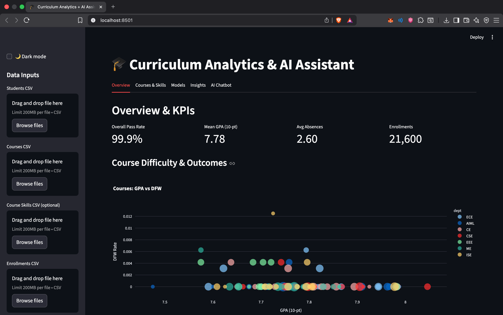

#  Curriculum Analytics Platform for Higher Education

An interactive analytics application that helps academic departments understand
student performance, identify difficult courses, flag at-risk students, and
make data-informed curriculum decisions. It pairs an interactive **Streamlit**
web app (with predictive models and a built-in assistant) with a **Power BI**
dashboard layer for executive reporting.

> Built on a configurable synthetic dataset so it runs out of the box, and
> accepts your own institutional CSVs with no code changes.

** Live demo:** (https://curriculum-analytics-platform.streamlit.app/)

---

##  Features

- **KPI overview** — pass rate, mean GPA (10-point scale), average absences, and total enrollments, all responsive to sidebar filters (year, term, department, semester).
- **Course difficulty index** — a composite score combining DFW rate, GPA, absences, and re-attempts to surface the hardest courses.
- **Skill-level analysis** — DFW and GPA rolled up by the skill each course teaches.
- **Predictive models**
  - Random Forest — pass/fail prediction with feature-importance ranking.
  - K-Nearest Neighbors — grade-band classification.
  - Linear Regression — estimates which factors most drive scores.
- **At-risk detection** — heuristic risk scoring from attendance and performance.
- **Personalized recommendations** — actionable, rule-based guidance per student.
- **AI chat assistant** — plain-language Q&A over the filtered data (uses a local [Ollama](https://ollama.com) model if available, with a graceful built-in fallback).
- **Power BI dashboard** — a star-schema export feeds a polished BI layer for sharing with non-technical stakeholders.
- **Export everywhere** — every table and chart can be downloaded as CSV/PNG.

---

##  Demo



*Power BI dashboard — to be added. This repo ships with `export_for_powerbi.py`
and [docs/POWERBI_GUIDE.md](docs/POWERBI_GUIDE.md) so the BI layer can be built in
Power BI Desktop and dropped in here.*

---

##  Tech Stack

| Layer | Tools |
|-------|-------|
| Language | Python 3.10+ |
| Web app | Streamlit |
| Data | pandas, NumPy |
| Visualization | Plotly (in-app), Power BI (BI layer) |
| Machine learning | scikit-learn (RandomForest, KNN, LinearRegression) |
| Assistant (optional) | Ollama (local LLM) |

---

##  Project Structure

```
curriculum-analytics-platform/
├── streamlit_app.py          # Streamlit UI (presentation layer only)
├── analytics.py              # All data + ML logic (no UI) — reusable & testable
├── export_for_powerbi.py     # Builds a star-schema CSV set for Power BI
├── requirements.txt
├── .gitignore
├── README.md
├── docs/
│   ├── POWERBI_GUIDE.md      # Step-by-step Power BI build instructions
│   └── images/               # Screenshots used in this README
└── data/
    └── powerbi/              # Generated CSVs for Power BI (git-ignored)
```

The data/ML logic is deliberately separated from the UI so the same functions
power the web app, the Power BI export, and any notebooks or tests.

---

##  Getting Started

### 1. Clone and set up

```bash
git clone https://github.com/gunjankhadka008/curriculum-analytics-platform.git
cd curriculum-analytics-platform

python -m venv .venv
source .venv/bin/activate        # Windows: .venv\Scripts\activate

pip install -r requirements.txt
```

### 2. Run the web app

```bash
streamlit run streamlit_app.py
```

The app opens in your browser. By default it uses synthetic demo data; toggle
it off and upload your own `students.csv`, `courses.csv`, `enrollments.csv`
(and optional `course_skills.csv`) from the sidebar.

### 3. (Optional) Enable the AI assistant

```bash
# install Ollama from https://ollama.com, then:
ollama pull tinyllama
# optionally choose a different model:
export OLLAMA_MODEL=llama3
```

Without Ollama, the assistant still answers common questions using a built-in
summary-based fallback.

### 4. Run the tests

```bash
pytest
```

The suite covers the pure logic in `analytics.py` (data generation, joins, KPIs,
models, and diagnostics).

---

##  Deploy a live demo

The app deploys free on **Streamlit Community Cloud**, straight from this repo:

1. Go to [share.streamlit.io](https://share.streamlit.io) and sign in with GitHub.
2. Click **Create app** → select this repository, branch `main`, main file `streamlit_app.py`.
3. Click **Deploy**. In a couple of minutes you'll get a public `*.streamlit.app` URL.
4. Paste that URL into the **Live demo** line at the top of this README and into the
   repository's **About** panel on GitHub.

The default demo-data toggle means the deployed app works immediately, with no
data upload required.

---

##  Power BI Dashboard

Generate the data Power BI connects to:

```bash
python export_for_powerbi.py                 # demo data
python export_for_powerbi.py --input-dir ./my_data   # your own CSVs
```

This writes a star schema (`dim_students`, `dim_courses`, `dim_course_skills`,
`fact_enrollments`, plus a pre-aggregated `agg_course_kpis`) into
`data/powerbi/`. Full build instructions are in
**[docs/POWERBI_GUIDE.md](docs/POWERBI_GUIDE.md)**.

---

##  Data Schema

| Table | Key columns |
|-------|-------------|
| students | `student_id`, `department`, `hs_percent`, `attendance_overall`, `family_income_lpa`, `extracurricular_index` |
| courses | `course_id`, `course_code`, `course_name`, `dept`, `semester`, `credits`, `is_core`, `contact_hours` |
| course_skills | `course_id`, `skill` |
| enrollments | `student_id`, `course_id`, `year`, `term`, `grade`, `numeric_score`, `passed`, `attempts`, `absences` |

---

##  Capturing the demo

1. Run the app and arrange the view you want.
2. Take screenshots (or record a short GIF with [ScreenToGif](https://www.screentogif.com/) / macOS screen recording).
3. Save them into `docs/images/` and they'll appear in this README.
4. For Power BI, use **File → Export → PowerPoint/PDF** or a screenshot of the report page.

---

##  Notes & Limitations

- The bundled dataset is **synthetic** and meant for demonstration. On this
  demo data the pass rate is very high, so the Random Forest pass/fail accuracy
  is inflated; with real, more balanced institutional data the models become
  more informative. Consider reporting balanced accuracy / a confusion matrix
  on real data.
- The assistant is intended for lightweight, read-only Q&A, not as a source of
  record.

---

##  Roadmap

- [ ] Replace heuristic at-risk scoring with a calibrated model
- [ ] Add confusion matrices and balanced-accuracy reporting
- [ ] Unit tests for the `analytics` module
- [ ] Optional database backend for institutional deployments

---

##  License

Released under the MIT License — see [LICENSE](LICENSE).

##  Author

**Gunjan Khadka** — [GitHub](https://github.com/gunjankhadka008) · [LinkedIn](https://www.linkedin.com/in/gunjan-khadka-31685b411/)
